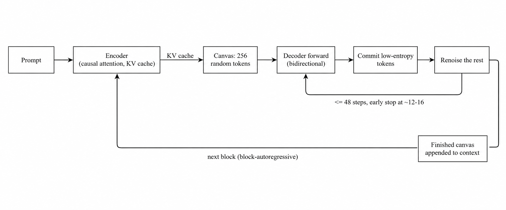
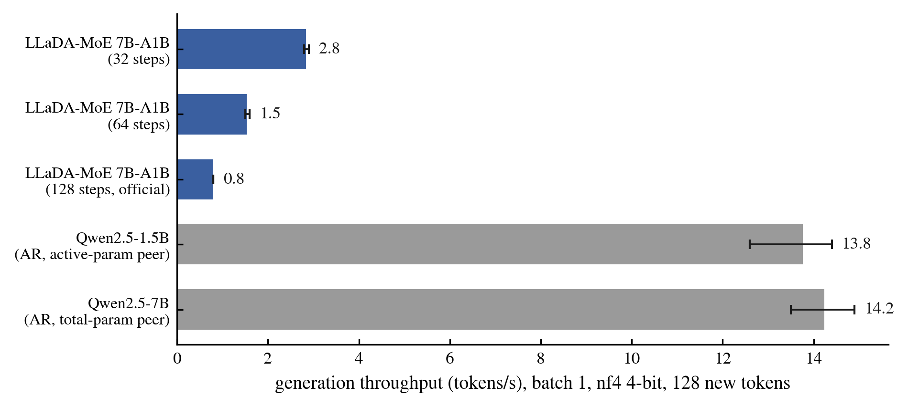

# DiffusionGemma Lab

Verifying Google DiffusionGemma's "up to 4x faster text generation with diffusion" claim
(released 2026-06-10) by reading the official inference code and running measurements on a
consumer-grade GPU.

TL;DR:

- Reading the code, the "diffusion" is really **entropy-guided iterative refinement**.
  There is no timestep embedding, no noise schedule, no noise prediction
- Where the speed comes from: replacing 256 memory-bound one-token AR decode steps with
  12-48 parallel forwards over a 256-token canvas
- Measured on a consumer GPU (69M toy model, same weights for both sides): one 256-token
  canvas forward costs only **1.27x** a single-token decode -> 12-17x speedup at the
  typical 12-16 steps, still 4.2x at the 48-step cap
- The speedup depends entirely on **model confidence (low entropy)**. An untrained model
  commits exactly 1 token per step and ends up slower than AR (measured)
- Batch size kills the advantage: measured speedup collapses from 14.4x (bs=1) to 1.4x
  (bs=16) -- diffusion decoding helps latency, not high-throughput serving
- A real 2025-generation diffusion LLM (LLaDA-MoE-7B-A1B: no KV cache, fixed-step
  schedule) measures **15x slower** than its AR active-param peer at official settings on
  the same GPU and quantization. "Diffusion" alone is not fast -- DiffusionGemma's KV-cached
  encoder and adaptive stopping are the actual speed engineering

## 1. What is DiffusionGemma

- Google DeepMind's first open-weights text diffusion LLM. Apache 2.0
- Based on the Gemma 4 26B A4B MoE (26B total, ~4B active, top-8 of 128 experts)
- Instead of decoding token-by-token, it iteratively denoises a 256-token "canvas"
- Official claims: 1,008 tok/s on H100 FP8 (~5x over AR), typically converges in 12-16 steps
- Quality is consistently below same-size Gemma 4 (AIME 69.1 vs 88.3, GPQA 73.2 vs 82.3)
- No arXiv paper yet. Primary sources are the [model card], the [official blog post], and
  the Transformers implementation itself

[model card]: https://ai.google.dev/gemma/docs/diffusiongemma/model_card
[official blog post]: https://blog.google/innovation-and-ai/technology/developers-tools/diffusion-gemma-faster-text-generation/

Note: the official inference code is not a standalone repository -- it is **merged directly
into Hugging Face `transformers`** (`transformers>=5.8`,
`src/transformers/models/diffusion_gemma/`). All analysis and experiments here target that
code.

## 2. The generation algorithm, as written in the code

Distilled from a close reading of the implementation (~5,500 lines). Full analysis with
line references: [docs/01-generation-algorithm.md](docs/01-generation-algorithm.md)
(Korean).



*Figure 1. The block-diffusion generation pipeline as implemented: the encoder plays the
role of AR prefill over the context, the decoder iteratively denoises a 256-token canvas
(commit low-entropy positions, re-randomize the rest), and finished canvases chain
block-autoregressively.*

Key details (all verified in code):

1. **Canvas init is uniform random tokens from the vocab, not [MASK]**
2. **Acceptance rule**: sort positions by entropy ascending and commit the largest
   confident prefix satisfying `cumsum(H) - max(H) <= 0.1`. The rule comes from
   [arXiv:2505.24857](https://arxiv.org/abs/2505.24857) (entropy-bounded unmasking),
   cited in a code comment. Mathematically it always commits at least 1 token per step
3. **Early stop**: argmax canvas unchanged from the previous step (stable) AND mean
   entropy < 0.005 (confident) -- both required
4. **Temperature schedule**: linear 0.8 -> 0.4 across steps (distribution sharpens)
5. **Final output is the argmax canvas**. The multinomial sample is only used to decide
   which positions to commit
6. **Encoder and decoder share all weights** -- effectively one model with two attention
   modes (causal over context, bidirectional inside the canvas)
7. Short answers still pay for a full 256-token canvas; there is no early exit inside
   a canvas

Distance from the marketing: it is called a "diffusion model", but none of the continuous
diffusion machinery (timestep embedding, noise schedule, noise prediction network) exists.
Precisely speaking it is **temperature-scheduled, entropy-guided parallel iterative
refinement**.

## 3. Experiments on a consumer GPU that cannot run the real model

The real 26B needs ~18GB VRAM even at NVFP4, beyond the consumer GPU used here. Instead we
plug **tiny models into the real Transformers generation code** and instrument the
algorithm's dynamics. The subject is sampler behavior, not text quality.

Code: [experiments/01_sampler_dynamics/run.py](experiments/01_sampler_dynamics/run.py),
numbers: [results.json](experiments/01_sampler_dynamics/results.json)

### EXP A. With an unconfident model, diffusion degenerates (real generate loop)

We push an untrained (random-weight) 1M model through the real `generate()` and instrument
the sampler.

- Mean entropy stays at uniform (6.91 nats) -> early stop never fires, hits the 48-step cap
- **Tokens committed per step: exactly 1.00** -- only the rule's at-least-one guarantee fires
- `tokens_per_forward` (the official efficiency metric reported by `generate()`) = 1.19,
  i.e. effectively AR efficiency


*Figure 2. Untrained model in the real generation loop: per-step committed tokens (bars)
never exceed the at-least-one guarantee, and mean canvas entropy (line) stays at the
uniform bound, so adaptive stopping never fires.*

Implication: the speed advantage comes from **trained confidence**, not from the
architecture. On inputs the model is unsure about (hard problems, out-of-distribution
text), step counts should rise and the advantage shrink.

### EXP B. Commit waves as confidence ramps (real sampler classes + synthetic logits)

We drive the real `EntropyBoundSampler`, temperature schedule, and stopping criteria with
synthetic logits whose confidence grows over steps, with per-position difficulty. Easy
positions commit first, in waves.


*Figure 3. Canvas convergence under a synthetic confidence ramp (growth = 1.0): dark cells
are committed positions. Easy positions commit first; commits sweep across the canvas in
waves until adaptive stopping fires.*

- Scaling the confidence growth rate by 0.5/1/2/4 changes convergence to 31/18/10/6 steps --
  the "typically 12-16 steps" claim is equivalent to a claim about how fast the trained
  model becomes confident
- Raising `entropy_bound` from 0.01 to 10 raises commits per step from 29 to 90. It is the
  aggressiveness (speed) knob; the quality cost needs measuring on the real model


*Figure 4. (a) Faster confidence growth means fewer steps until adaptive stop. (b) The
entropy bound epsilon controls how many tokens commit per step -- the aggressiveness knob.*

### EXP C. Measured speed model: how cheap is a canvas forward

Measured with a 69M toy (identical weights for both modes):

*Table 1. Canvas forward vs AR decode, measured (batch 1).*

| measurement | result |
|---|---|
| one 256-token canvas forward (marginal cost) | 51.5 ms |
| one AR 1-token decode (KV cache, same encoder weights) | 40.5 ms |
| cost ratio (canvas / 1-token) | **1.27x** |
| implied speedup at 12 steps | 16.8x |
| at 16 steps | 12.6x |
| at the 48-step cap | 4.2x |


*Figure 5. Measured speed model: speedup over AR decode as a function of denoising steps
per 256-token canvas. Shaded band: vendor's typical convergence range; dashed line: the
48-step cap.*

Interpretation: a 1-token decode is bound by weight loading (memory bandwidth), not
compute, so pushing 256 tokens through at once costs only 1.27x. That is the hardware
essence of the diffusion speed claim. The vendor's "4-6x" is more conservative than our toy
measurement (12-17x at 12-16 steps), presumably because the real 26B has a much larger
compute share, making the canvas forward relatively pricier. Caveat: toy scale on a
consumer GPU -- this validates the structure, not absolute numbers.

### EXP D. Comparison 1: same code, varying size and batch (hypothesis tests)

Two hypotheses for why the vendor number is lower than our toy number, swept with the same
DiffusionGemma code. Median of 3 runs.
Code: [experiments/02_scaling_batch/run.py](experiments/02_scaling_batch/run.py),
numbers: [results.json](experiments/02_scaling_batch/results.json)

**Hypothesis 1 -- bigger model, smaller advantage: not observable at toy scale (null
result).** Across 17M-336M the canvas/1-token cost ratio stays flat at 1.1-1.2. All these
sizes are far below GPU compute saturation; the compute-share effect cannot be seen at toy
scale. Verifying it needs the real 26B on cloud hardware.


*Figure 6. Size sweep, batch 1, median of 3. (a) The canvas/1-token cost ratio and (b) the
implied 16-step speedup are both flat across 17M-336M: a null result -- the toy regime
never approaches compute saturation.*

**Hypothesis 2 -- bigger batch, vanishing advantage: strongly confirmed.** From batch 1 to
16 the cost ratio explodes from 1.1 to 11.2 and the 16-step speedup collapses from 14.4x to
1.4x. This confirms vLLM's "particularly attractive at low batch sizes" framing, and shows
the flip side: **at high-batch serving, the diffusion speed advantage effectively
disappears.**

*Table 2. Batch sweep at 97M, median of 3.*

| batch | cost ratio (canvas/1tok) | speedup at 16 steps |
|---|---|---|
| 1 | 1.11 | 14.4x |
| 2 | 1.51 | 10.6x |
| 4 | 1.61 | 10.0x |
| 8 | 2.59 | 6.2x |
| 16 | 11.22 | 1.4x |


*Figure 7. The diffusion advantage collapses toward AR parity as batch size grows: the
canvas forward saturates compute while AR decode stays bandwidth-bound.*

### EXP E. Comparison 2: a real 2025 diffusion LLM vs AR peers, same GPU

DiffusionGemma itself cannot run here, but the closest runnable open dLLM can:
**LLaDA-MoE-7B-A1B-Instruct** (inclusionAI, 2025) is a sparse-MoE diffusion LLM with 7B
total / 1.4B active parameters -- the same architecture family as DiffusionGemma 26B-A4B.
We benchmark it with its official model-card sampler (mask-based, low-confidence
remasking) against two AR peers: **Qwen2.5-1.5B** (active-parameter peer) and
**Qwen2.5-7B** (total-parameter peer). All three quantized identically (bitsandbytes nf4),
batch 1, 128 new tokens, greedy, 3 prompts (math / Korean / code).

Code: [experiments/03_real_models/run.py](experiments/03_real_models/run.py),
numbers and full outputs: [results.json](experiments/03_real_models/results.json)

*Table 3. Measured throughput (mean over 3 prompts), single consumer GPU, nf4 4-bit.*

| model | active / total params | decoding | tok/s | peak VRAM |
|---|---|---|---|---|
| LLaDA-MoE-7B-A1B | 1.4B / 7B | diffusion, 128 steps (official) | 0.8 | 4.7 GiB |
| LLaDA-MoE-7B-A1B | 1.4B / 7B | diffusion, 64 steps | 1.5 | 4.7 GiB |
| LLaDA-MoE-7B-A1B | 1.4B / 7B | diffusion, 32 steps | 2.8 | 4.7 GiB |
| Qwen2.5-1.5B | 1.5B / 1.5B | AR, greedy | 13.8 | 1.2 GiB |
| Qwen2.5-7B | 7.6B / 7.6B | AR, greedy | 14.2 | 5.6 GiB |



*Figure 8. A 2025-generation diffusion LLM is an order of magnitude slower than AR peers
on consumer hardware: 0.8 vs 13.8 tok/s at official settings (15x). Whiskers: min-max over
the 3 prompts.*

The result inverts the "diffusion = fast" marketing, and the reasons are exactly the two
things DiffusionGemma changed:

1. **No KV cache.** LLaDA's sampler re-forwards the full sequence (prompt + 128 tokens)
   at every step. DiffusionGemma's encoder caches the context, so each denoising step
   forwards only the 256-token canvas
2. **Fixed-step schedule.** The official setting (steps = gen_length = 128) commits
   exactly 1 token per forward -- AR-equivalent forward count, but each forward is a full
   uncached sequence. Even at steps=32 (4 tokens/forward) it stays 5x behind AR.
   DiffusionGemma's entropy-bound acceptance + adaptive stopping exist precisely to push
   tokens-per-forward up without a fixed schedule

Qualitative spot checks (full text in results.json): LLaDA-MoE's Korean output is
essentially broken code-switching ("대ositories의 rollover는 인구입니다"), while even the
1.5B AR peer answers fluently. Its math answer reasons correctly but locks into a
tool-call JSON format. Caveats: single prompt per category, greedy decoding, and nf4
quantization overhead flattens AR throughput (1.5B and 7.6B measure nearly the same), so
read these numbers as relative, not absolute.

Bottom line: **"diffusion LLM" is not intrinsically fast.** The speed story depends on
serving engineering (context caching, adaptive steps) that the 2026 DiffusionGemma added
and 2025 open dLLMs lack. Whether DiffusionGemma's own 4-6x claim holds end-to-end still
needs the cloud-GPU run.

### Side finding: an upstream bug

Passing `confidence_threshold=0.0` makes the validator's error message reference a
nonexistent `self.entropy_bound`, raising AttributeError instead of the intended ValueError
(`generation_diffusion_gemma.py:177`, transformers 5.11.0).

## 4. Reproduce

```bash
python3 -m venv --system-site-packages .venv   # assuming torch+CUDA present
.venv/bin/pip install "transformers>=5.11" matplotlib
.venv/bin/python experiments/01_sampler_dynamics/run.py
.venv/bin/python experiments/02_scaling_batch/run.py

# EXP E needs a second venv: LLaDA-MoE custom code targets transformers 4.53
python3 -m venv --system-site-packages .venv-llada
.venv-llada/bin/pip install "transformers==4.53.2" bitsandbytes accelerate
.venv-llada/bin/python experiments/03_real_models/run.py   # downloads ~32GB of models
```

Figures re-render from saved results without re-measuring: each experiment has a
`plot.py` (shared style in `experiments/paperstyle.py`).

To fetch the official code/config locally:

```bash
# model config/tokenizer only (skip the 26B LFS weights)
GIT_LFS_SKIP_SMUDGE=1 git clone --depth 1 \
  https://huggingface.co/google/diffusiongemma-26B-A4B-it reference/hf-model
# Transformers implementation (analysis pinned at commit 8014139)
git clone --depth 1 --filter=blob:none --sparse \
  https://github.com/huggingface/transformers reference/transformers
git -C reference/transformers sparse-checkout set src/transformers/models
```

## 5. Next steps

- [ ] Run the real 26B on a cloud GPU (H100-class), reproduce the official 1,008 tok/s
- [ ] Head-to-head vs Gemma 4 26B A4B (AR) on the same hardware -- batch 1/4/16 curves
- [ ] `max_denoising_steps` / `entropy_bound` vs output quality trade-off (real model)
- [ ] Korean output quality, block-boundary (multiples of 256) coherence, long-context
      degradation spot checks
- [ ] Find out what vLLM "native support" actually is (no diffusion code in vLLM main as
      of 2026-06-11)

## Environment

Single consumer-grade NVIDIA GPU (specs undisclosed) / torch 2.12 / transformers 5.11.0
